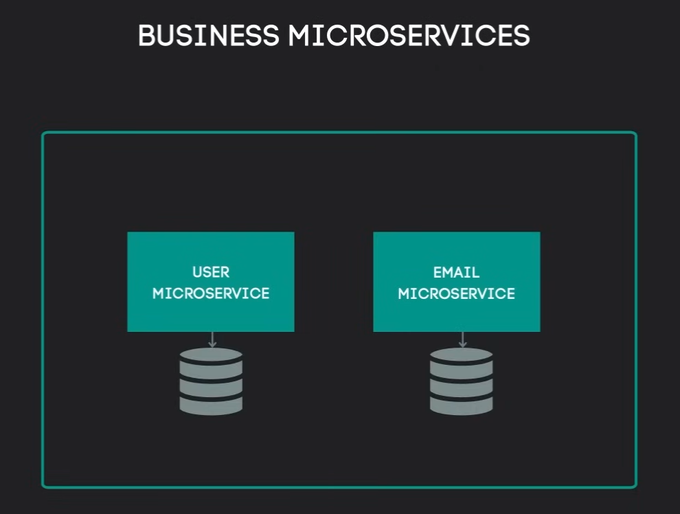
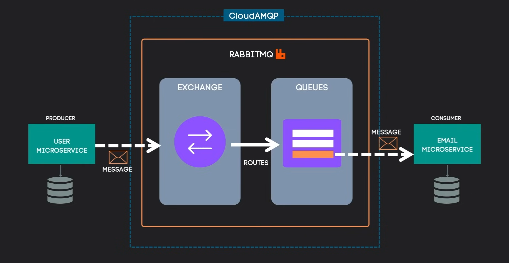
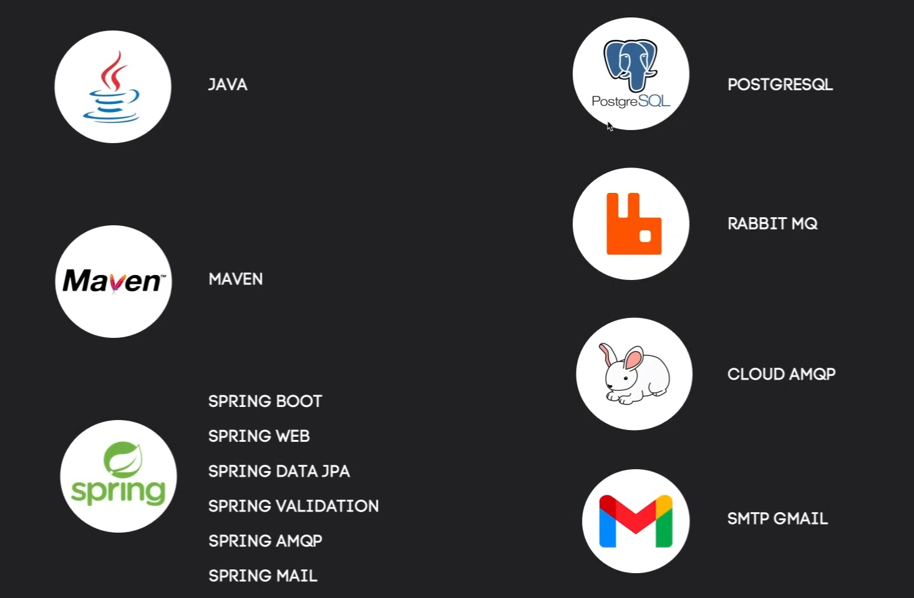

# MicroServices na prática

Iremos fazer uma arquitetura de microserviços implementando a conexão assíncrona entre eles e o broker RabbitMQ



Comunicação de comandos onde o microservice User irá produzir uma mensagem enviando para outro microservice para que ele realize a ação.

## Flow


1. Um cliente irá enviar um POST /USERS para cadastrar um novo usuário.
    - Criar o User Microservice
    - Criar um endpoint para registrar um novo usuário
    - Salvar o novo usuário na base de dados
    - Publicar uma mensagem para o Broker
2. O Broker irá receber uma mensagem do User Microservice
3. O Broker irá enviar a mensagem para o Email Microservice
4. O Email Microservice irá está esperando uma mensagem do Broker
    - Criar o Email Microservice
    - Conectar no canal de mensagens do Broker
    - Ouvir a mensagem do Broker
    - Realizar o envio do e-mail
    - Salvar o e-mail na arquiterura

## RabbitMQ Flow



Como o `User Microservice` vai produzir uma mensagem para enviar para o Broker, ele será denominado como `Producer`.

O RabbitMQ é formado pela junção das estruturas de `Exchange` e `Queues`, assim recebendo as mensagens do `Producer` o `Exchange` irá olhar a mensagem e fazer o devido roteamento para as respectivas `Queues`.

O `Consumer` irá está conectado no canal de mensagens do Broker e ouvir as mensagens enviadas pelas `Queues` e realizar a ação correspondente.

## Ferramentas utilizadas



- Java - Linguagem de programação na versão 17
- Maven - Gerenciador de dependências
- Spring - Framework
    - Spring Boot - Criar o projeto
    - Spring Web - Criar os endpoints
    - Spring Data JPA - Interagir com a base de dados
    - Spring Validation - Validar os dados
    - Spring AMQP - Protocolo de mensageria
    - Spring Mail - Enviar e-mails
- PostgreSQL - Base de dados
- RabbitMQ - Broker
- Cloud AMQP - Platformas de mensageria
- SMTP Gmail - Servidor de e-mail

## Projeto

### Implementação do User Microservice

```properties
project=Maven
Spring Boot=3.4.2

# Project Metadata
Group=com.ms
Artifact=user
Package=com.ms.user

Java=17

# Dependencies
Spring Web
Spring Data JPA
PostgreSQL Driver
Validation
Spring for RabbitMQ
```

#### Conexão com a base de dados

```properties
# Definir a porta para o User Microservice
server.port=8081 

# Conexão com a base de dados
spring.datasource.url=jdbc:postgresql://localhost:5432/ms-user 
spring.datasource.username=postgres
spring.datasource.password=1234567

# Gerenciamento da base de dados
spring.jpa.hibernate.ddl-auto=update
```

Após configurar o User Microservice, vamos configurar a entidade User:

```java
@Id
@GeneratedValue(strategy = GenerationType.AUTO)
private UUID id;
private String email;
private String password;
```

> [!TIP]
> Usaremos o UUID para gerar o ID do usuário pois com sistema distribuído como o nosso, o IDs sequencial podem causar conflitos.


### Implementação do Email Microservice

```properties
project=Maven
Spring Boot=3.4.2

# Project Metadata
Group=com.ms
Artifact=email
Package=com.ms.email

Java=17

# Dependencies
Spring Web
Spring Data JPA
PostgreSQL Driver
Validation
Spring for RabbitMQ
Java Mail Sender
```

#### Conexão com a base de dados

```properties
# Definir a porta para o Email Microservice
server.port=8082

# Conexão com a base de dados
spring.datasource.url=jdbc:postgresql://localhost:5432/ms-email
spring.datasource.username=postgres
spring.datasource.password=1234567

# Gerenciamento da base de dados
spring.jpa.hibernate.ddl-auto=update
```
